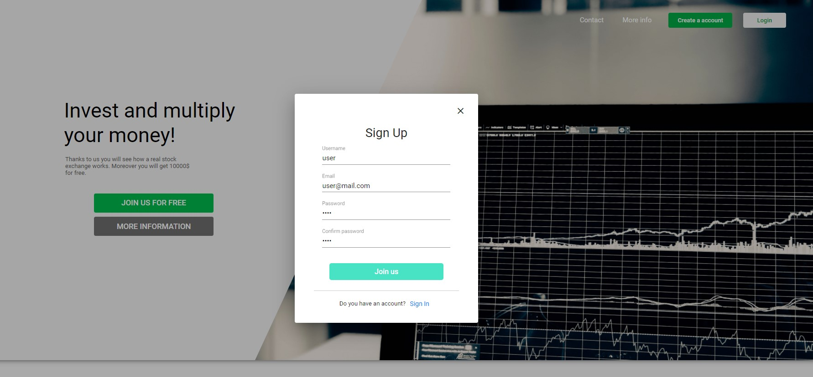
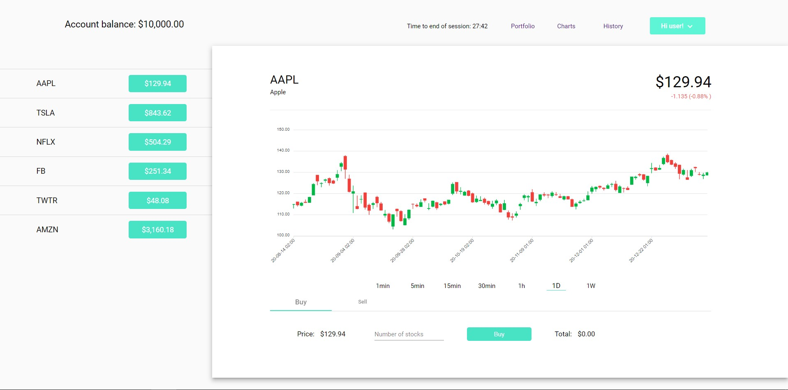
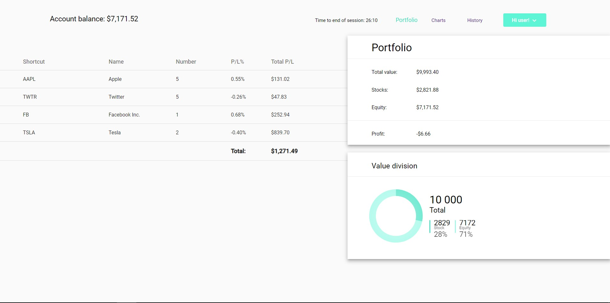
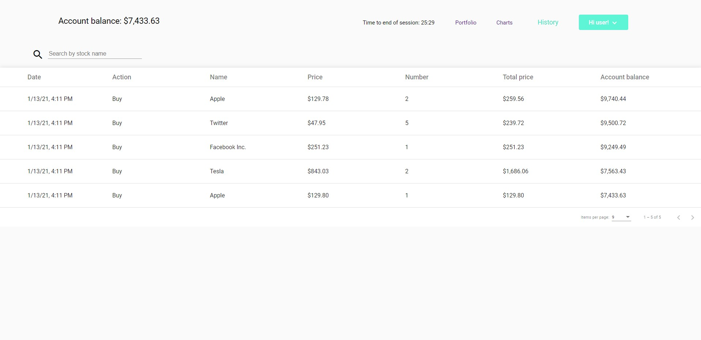

# StockExchangeApp

## About
StockExchangeApp is a simulation of real stock exchange market. Information about share prices is loaded using websocket. It is not sent at all times and you have to wait a while after logging into the website.

## Functionalities
The user can create an account where entered password is encoded using bcrypt hashing function. After logging into the account apart form the authentication that checks the correctness of the entered data by the user there is generated a JWT token. It is only valid for 30 minutes and after this time the user is asked to extend the session. The user can make buy / sell transactions and has access to their history.

## Installation

In the first step you have to go to the 'websocket-key.ts' file located in the `StockExchangeApplication\src\app\models` directory and enter a valid value for the TOKEN variable. Open the 'StockExchangeApp' directory in a terminal and enter the `docker-compose up --build` command to run all services. Navigate to `http://localhost:4200/`.

## Images

